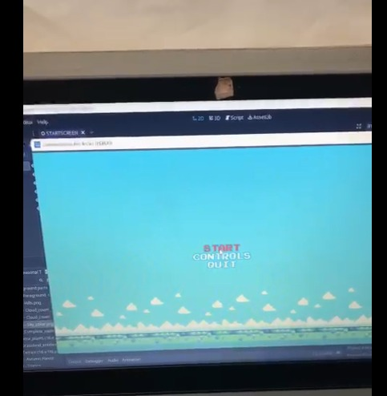
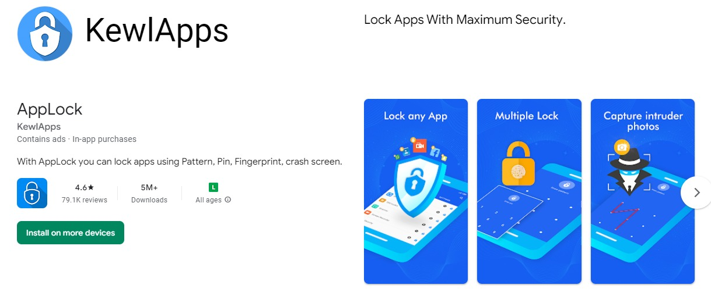
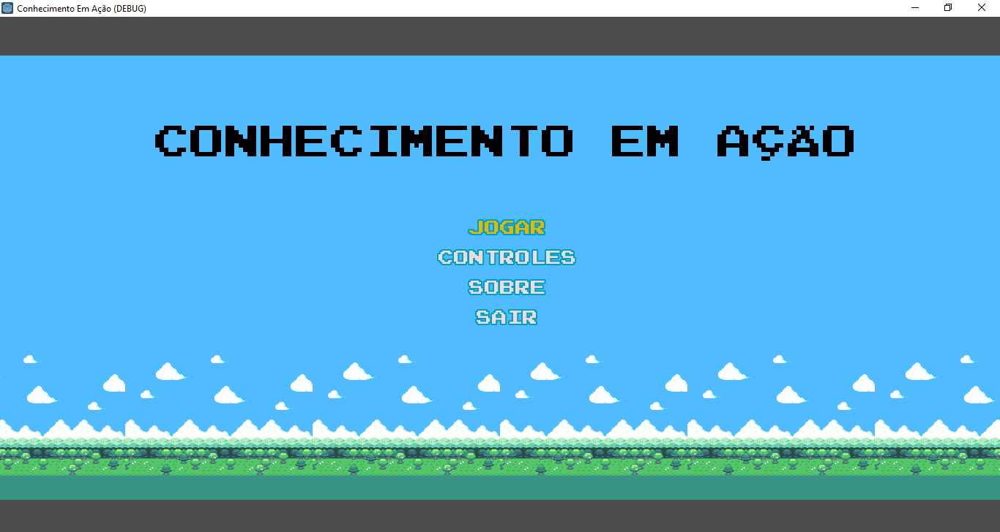
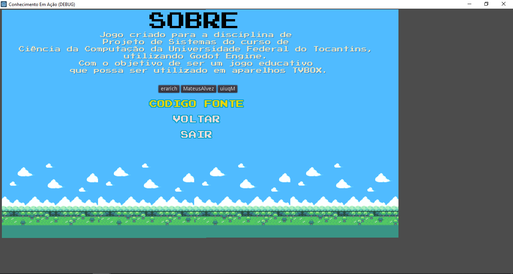
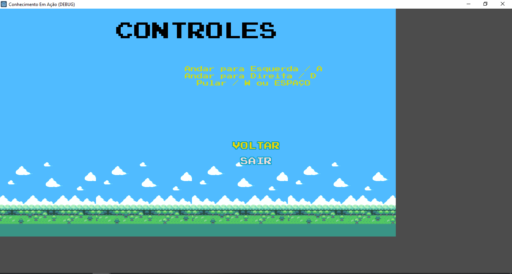
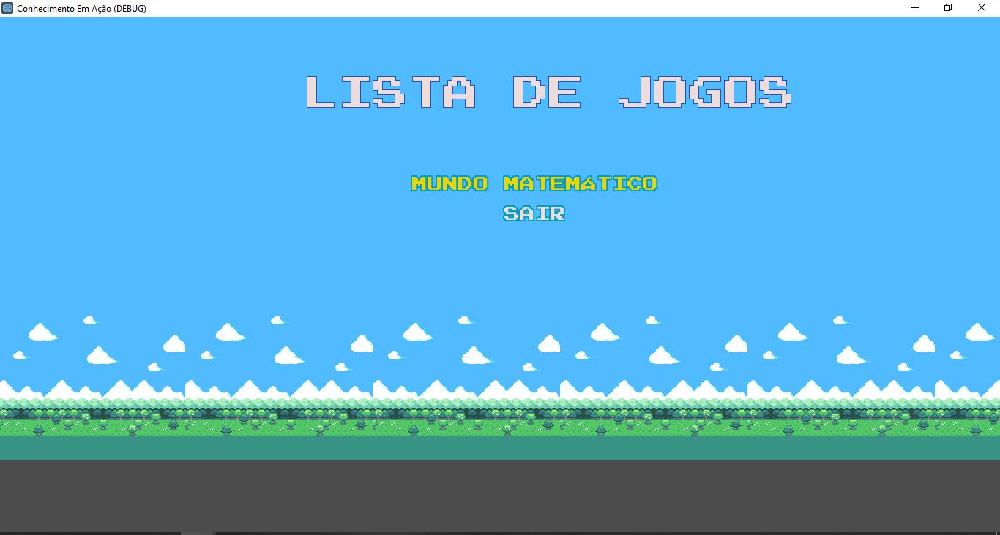
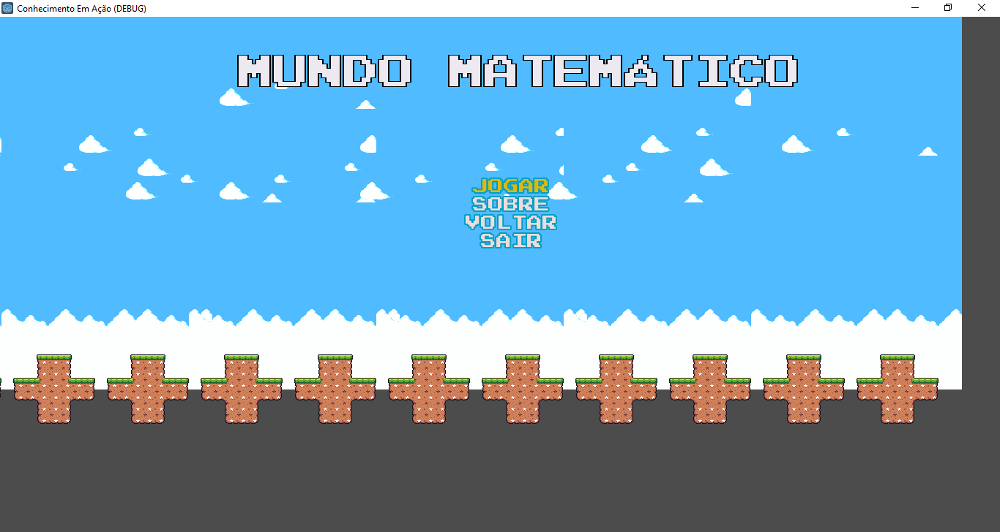
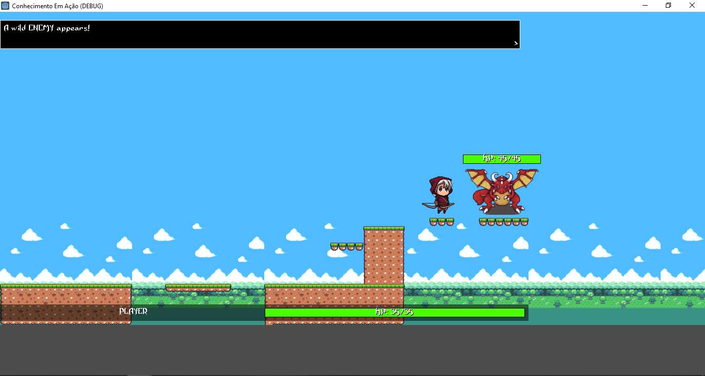
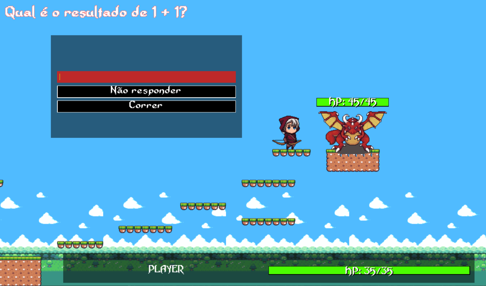

# Sprints

## Sprint 1 (21/08 - 04/09)

**Objetivo Principal:** Estabelecer as bases iniciais do projeto com um foco específico no desenvolvimento do primeiro jogo.

**Tarefas:**

1. **Configurar o Ambiente de Desenvolvimento:** Utilizar a engine Godot 3.5.2 para criar o ambiente de desenvolvimento necessário.
2. **Desenvolver o Menu Principal (_Requisito Funcional RF02_):** Criar um menu principal interativo e envolvente para a aplicação.

3. **Construir o Menu do Primeiro Jogo (_Requisito Funcional RF04_):** Criar o menu específico para o primeiro jogo, permitindo aos jogadores acessar as funcionalidades relacionadas a ele.

4. **Prototipar o Primeiro Jogo com Ênfase nos Desafios Matemáticos:** Desenvolver um protótipo inicial do primeiro jogo, focando na implementação dos desafios matemáticos e mantendo os detalhes gráficos em segundo plano. Esta etapa aborda os requisitos _RF05_, _RF06_, _RF07_ e _RF08_.

### Resultados alcançados

- Configuração de ambiente foi configurado corretamente;
- Os menus do jogo foram desenvolvidos;
- Foi utilizado uma solução alto nível para o aparelho TVBOX: o aplicativo AppLock.

## Sprint 2 (05/09 - 18/09)

**Objetivo Principal:** Possuir uma versão demonstração do primeiro jogo.

#### 1. Prototipar a gameplay do mini-jogo 1.

- **Dificuldade:** muito difícil
- **Autores:** [Érick Santos](https://github.com/erarich), [Mateus Alves](https://github.com/MateusAlvez) e [Wilque Muriel](https://github.com/uiuqM).

#### 2. Indicar títulos das cenas nas respectivas cenas.

- **Dificuldade:** muito fácil
  ~~- **Autor:** [Wilque Muriel](https://github.com/uiuqM).~~[Érick Santos](https://github.com/erarich)

#### 3. Alterar o idioma dos menus para língua portuguesa.

- **Dificuldade:** fácil
  ~~- **Autor:** [Wilque Muriel](https://github.com/uiuqM).~~[Érick Santos](https://github.com/erarich)

~~#### 4. Adicionar confirmação de saída do jogo.~~
~~- **Dificuldade:** médio~~
~~- **Autor:** [Mateus Alves](https://github.com/MateusAlvez)~~

~~#### 5. Adicionar cena de configuração no menu principal para configurar volume de som.~~  
~~- **Dificuldade:** difícil~~
~~- **Autor:** [Mateus Alves](https://github.com/MateusAlvez)~~

#### 6. Adicionar música para o menu principal.

- **Dificuldade:** fácil
- **Autor:** ~~[Érick Santos](https://github.com/erarich).~~ [Wilque Muriel](https://github.com/uiuqM).

#### 7. Adicionar som para interações do usuário com a interface.

- **Dificuldade:** difícil
- **Autor:** [Érick Santos](https://github.com/erarich).

#### 8. Adicionar transições animadas quando as cenas são alteradas.

- **Dificuldade:** médio
- **Autor:** [Wilque Muriel](https://github.com/uiuqM).

#### 9. Alterar o design do menu de jogos.

- **Dificuldade:** fácil
- **Autor:** [Érick Santos](https://github.com/erarich).

#### 10. Alterar o design do menu do mini-jogo 1.

- **Dificuldade:** fácil
- **Autor:** [Érick Santos](https://github.com/erarich).

#### 11. Inserir tela de instruções do mini-jogo 1.

- **Dificuldade:** médio
- **Autor:** [Wilque Muriel](https://github.com/uiuqM).

#### 12. Finalizar a primeira fase do mini-jogo 1.

- **Dificuldade:** muito difícil
- **Autores:** [Érick Santos](https://github.com/erarich), [Mateus Alves](https://github.com/MateusAlvez) e [Wilque Muriel](https://github.com/uiuqM).

#### 13. Criar pré-release e tag de release com o arquivo apk do jogo.

- **Dificuldade:** difícil
- **Autores:** [Wilque Muriel](https://github.com/uiuqM).

#### 14. Adicionar screenshots na seção de Resultados alcançados da Sprint 1.

- **Dificuldade:** médio
- **Autor:** [Mateus Alves](https://github.com/MateusAlvez).

#### 15. Adicionar screenshots na seção de Resultados alcançados da Sprint 2.

- **Dificuldade:** médio
- **Autor:** [Érick Santos](https://github.com/erarich).

#### 16. Adicionar seção de Premissas e Restrições no README.

- **Dificuldade:** fácil
- **Autor:** [Wilque Muriel](https://github.com/uiuqM).

#### 17. Corrigir arquivo de especificação de requisitos.

- **Dificuldade:** médio
- **Autor:** [Mateus Alves](https://github.com/MateusAlvez).

#### 18. Adicionar seção no README sobre TVBOX, incluindo como peça importante para o trabalho.

- **Dificuldade:** médio
- **Autor:** [Wilque Muriel](https://github.com/uiuqM).

#### 19. Finalizar apresentação comercial e técnica do produto.

- **Dificuldade:** muito difícil
- **Autores:** [Érick Santos](https://github.com/erarich), [Mateus Alves](https://github.com/MateusAlvez) e [Wilque Muriel](https://github.com/uiuqM).

### Resultados alcançados

A maioria das tasks foram realizadas, conforme segue imagens:

## Sprint 3 (19/09 - 02/10)

**Objetivo Principal:** Corrigir erros da versão atual do jogo, melhorar aspectos de jogabilidade, evoluir a primeira fase.

#### 1. Adicionar tasks no arquivo sprints.md.

- **Autor:** [Sophia Menezes](https://github.com/SophiaMenezes).

#### 2. Corrigir o número de versão no arquivo requirements.md.

- **Autor:** [Sophia Menezes](https://github.com/SophiaMenezes).

#### 3. Corrigir a seção de resultados no arquivo de sprints.md

- **Autor:** [Sophia Menezes](https://github.com/SophiaMenezes).

#### 4. Estruturar inimigos da primeira fase (nome, descrição, dificuldade).

- **Autor:** [Sophia Menezes](https://github.com/SophiaMenezes).

#### 5. Implementar movimentação do jogador.

- **Autor:** [Mateus Alves](https://github.com/MateusAlvez).

#### 6. Estruturar trilha sonora da fase 1.

- **Autor:** [Érick Santos](https://github.com/erarich).

#### 7. Corrigir o enquadramento das telas.

- **Autor:** [Mateus Alves](https://github.com/MateusAlvez).

#### 8. Melhorar diálogo dos personagens.

- **Autor:** [Mateus Alves](https://github.com/MateusAlvez).

#### 9. Melhorar tela de Batalha.

- **Autor:** [Érick Santos](https://github.com/erarich).

#### 10. Adicionar opção para desligar a música e sons de interação com interface no jogo.

- **Autor:** [Érick Santos](https://github.com/erarich).

#### 11. Criar um mapa didático com ensinamentos matemáticos.

- **Autores:** [Sophia Menezes](https://github.com/SophiaMenezes) e [Mateus Alves](https://github.com/MateusAlvez)

#### 12. Atualizar o Segmento de Clientes no Business Model Canvas.

- **Autor:** [Wilque Muriel](https://github.com/uiuqM).

#### 13. Adaptar o jogo para que o teclado seja utilizável. US 1.1.

- **Autor:** [Érick Santos](https://github.com/erarich).

#### 14. Adaptar o jogo para que o mouse seja utilizável. US 1.2.

- **Autor:** [Érick Santos](https://github.com/erarich).

#### 15. Testar controle remoto como dispositivo de entrada. US 1.3.

- **Autor:** [Mateus Alves](https://github.com/MateusAlvez).

#### 16. Testar se o jogo permite alternar entre dispositivos durante o jogo (execução). US 1.4.

- **Autor:** [Mateus Alves](https://github.com/MateusAlvez).

#### 17. Testar se o jogo permite alternar entre dispositivos durante o jogo (execução). US 1.5.

- **Autor:** [Mateus Alves](https://github.com/MateusAlvez).

### Resultados alcançados

- Foi adicionado um NPC (Non-player Character ou Personagem não jogável) para auxílio no jogo;
- Mudanças no ambiente do jogo, tornando-se mais didático;
- Movimentação do personagem corrigida e finalizada com inserção de animação;
- Correção do enqudramento das telas;
- Adição de tela de lista de desenvolvedores;
- Adição de música nas outras telas do jogo;
- Correção dos sons dos botões;
- Mudanças Canva Client;
- Referente a estruturação da primeira fase, temos:

  ### Primeira fase: Mundo Primavera

  A viagem pelo "Mundo Matemático" começa com a estação da Primavera, um cenário deslumbrante onde os jogadores iniciam sua jornada para resgatar a Matemática. Nessa fase inicial, os jogadores se deparam com uma série de desafios matemáticos abrangendo adição, subtração, multiplicação, divisão, porcentagem e expressões numéricas. À medida que exploram este cenário, encontrarão equações e enigmas que devem ser solucionados para progredir em sua jornada. Cada desafio resolvido os levará um passo mais perto de enfrentar o temível Chefão, Arithmetros, o Regente do Caos Numérico, e devolver a ordem à Matemática.

  | Nome                                                                                          | Descrição                                             |
  | --------------------------------------------------------------------------------------------- | ----------------------------------------------------- |
  | Somador do Caos, mestre das adições caóticas                                                  | Adição (Dificuldade: Fácil)                           |
  | Subtrator Sombrio, governante das operações subtrativas sombrias                              | Subtração (Dificuldade: Fácil)                        |
  | Misterioso Matemático, um ser misterioso que envolve os jogadores em quebra-cabeças numéricos | Expressões I (Adição e Subtração)(Dificuldade: Médio) |
  | Multiplicador Maluco, torna a multiplicação uma verdadeira loucura                            | Multiplicação (Dificuldade: Médio)                    |
  | Divisor da Escuridão, mestre sombrio da divisão                                               | Divisão (Dificuldade: Médio)                          |
  | Numbruxo, o feiticeiro numérico                                                               | Expressões II (Dificuldade: Médio/Difícil)            |
  | Porcentório, o regente das porcentagens perversas                                             | Porcentagem (Dificuldade: Médio/Difícil)              |
  | Arithmetros, o Regente do Caos Numérico                                                       | Chefão (Dificuldade: Difícil)                         |

## Sprint 4 (03/10 - 16/10)

**Objetivo Principal:** Corrigir erros da versão atual do jogo, melhorar aspectos de jogabilidade, evoluir as demais fases. Estruturar a relação habilidades/competências com o jogo.

#### 1. Concluir Mapa (Percurso do Personagem).

- **Autor:** [Mateus Alves](https://github.com/MateusAlvez).

#### 2. Estruturar a Trilha Sonora do jogo.

- **Autor:** [Wilque Muriel](https://github.com/uiuqM).

#### 3. Procurar Sprites dos Inimigos.

- **Autor:** [Sophia Menezes](https://github.com/SophiaMenezes).

#### 4. Adicionar Inimigos ao mapa.

- **Autor:** [Sophia Menezes](https://github.com/SophiaMenezes).

#### ~~5. Estruturar os outros mundos (Verão, Outono e Inverno).~~

- ~~**Autor:** [Sophia Menezes](https://github.com/SophiaMenezes).~~

#### 6. Adaptar o jogo para que o mouse/teclado seja utilizável. US 1.1 e US 1.2.

- **Autor:** [Mateus Alves](https://github.com/MateusAlvez).

#### 7. Corrigir tela de batalha.

- **Autor:** [Érick Santos](https://github.com/erarich).

#### 8. Reestruturar Pasta Diretório do projeto.

- **Autor:** [Érick Santos](https://github.com/erarich).

#### ~~9. Corrigir "bugs" das nuvens (visual).~~

- ~~**Autor:** [Sophia Menezes](https://github.com/SophiaMenezes).~~

#### 10. Tela de Pause.

- **Autor:** ~~[Mateus Alves](https://github.com/MateusAlvez)~~ [Wilque Muriel](https://github.com/uiuqM).

#### 11. HUD Básica.

- **Autores:** [Mateus Alves](https://github.com/MateusAlvez) e [Érick Santos](https://github.com/erarich).

#### 12. Morte do Personagem (Reiniciar).

- **Autor:** [Érick Santos](https://github.com/erarich).

#### 13. Morte dos Inimigos (Inimigos sumirem).

- **Autor:** [Érick Santos](https://github.com/erarich).

#### 14. Movimentação do Personagem (Colisão - Plataforma).

- **Autor:** [Sophia Menezes](https://github.com/SophiaMenezes).

#### 15. Salvamento.

- **Autor:** ~~[Mateus Alves](https://github.com/MateusAlvez).~~ [Wilque Muriel](https://github.com/uiuqM).

#### 16. Opção para usuário realizar o controle do áudio (música e sons de interaface).

- **Autor:** [Wilque Muriel](https://github.com/uiuqM).

#### 17. Planejar como serão as batalhas com cada inimigo, relacionando-as com cada habilidade da BNCC referente com o inimigo.

- **Autores:** [Sophia Menezes](https://github.com/SophiaMenezes) e [Érick Santos](https://github.com/erarich).

### Resultados alcançados

- Correção da tela de batalha;

- Referente às Habilidades da BNCC e como podemos adquirí-las jogando "Mundo Matemático", fizemos algumas correções na 1° Fase (Mundo Primavera);

| Nome                                                                                                 | Descrição                                                               | Objetos de Conhecimento                                                                                                                                                                                                                                                                                                                                                                                                                                          | Habilidade (BNCC)                           |
| ---------------------------------------------------------------------------------------------------- | ----------------------------------------------------------------------- | ---------------------------------------------------------------------------------------------------------------------------------------------------------------------------------------------------------------------------------------------------------------------------------------------------------------------------------------------------------------------------------------------------------------------------------------------------------------- | ------------------------------------------- |
| Misterioso Matemático, um ser misterioso que envolve os jogadores em quebra-cabeças numéricos        | Revisão e Expressões I (Adição e Subtração) Dificuldade: Fácil/Médio    | - Sistema de numeração decimal: leitura, escrita e ordenação de números naturais (de até seis ordens) - Problemas: adição e subtração de números naturais                                                                                                                                                                                                                                                                                                        | (EF05MA01) (EF05MA07)                       |
| Multiplicador Maluco, torna a multiplicação uma verdadeira loucura                                   | Multiplicação Dificuldade: Fácil/Médio                                  | Problemas: multiplicação e divisão de números naturais                                                                                                                                                                                                                                                                                                                                                                                                           | (EF05MA08)(EF05MA09)                        |
| Divisor da Escuridão, mestre sombrio da divisão                                                      | Divisão Dificuldade: Fácil/Médio                                        | Problemas: multiplicação e divisão de números naturais                                                                                                                                                                                                                                                                                                                                                                                                           | (EF05MA08)(EF05MA09)                        |
| Numbruxo, o feiticeiro numérico\*                                                                    | Expressões II Dificuldade: Médio/Difícil                                | Problemas: multiplicação e divisão de números naturais                                                                                                                                                                                                                                                                                                                                                                                                           | (EF05MA08)(EF05MA09)                        |
| Decimador Desafiante, desafia os jogadores com números racionais na forma decimal                    | Números Racionais na forma de decimal finito Dificuldade: Médio/Difícil | - Representação fracionária dos números racionais: reconhecimento, significados, leitura e representação na reta numérica - Comparação e ordenação de números racionais na representação decimal e na fracionária utilizando a noção de equivalência - Problemas: adição e subtração de números racionais cuja representação decimal é finita - Problemas: multiplicação e divisão de números racionais cuja representação decimal é finita por números naturais | (EF05MA02) (EF05MA05) (EF05MA07) (EF05MA08) |
| Quebrador de Frações, distorce frações e desafia os jogadores a reconhecer e corrigir as distorções. | Números Racionais na forma de frações Dificuldade: Médio/Difícil        | - Representação fracionária dos números racionais: reconhecimento, significados, leitura e representação na reta numérica - Comparação e ordenação de números racionais na representação decimal e na fracionária utilizando a noção de equivalência - Cálculo de porcentagens e representação fracionária                                                                                                                                                       | (EF05MA03) (EF05MA04) (EF05MA05) (EF05MA06) |
| Arithmetros, o Regente do Caos Numérico\*\*                                                          | Revisão                                                                 | Todos os anteriores                                                                                                                                                                                                                                                                                                                                                                                                                                              | Todas as Habilidades desenvolvidas          |

- Conforme o conversado com o professor no acompanhamento da Sprint, era necessário que fosse feito um planejamento para auxílio dos desenvolvedores e de melhor compreensão.

#### Planejamento do Mundo Primavera para auxílio dos desenvolvedores:

_- Objetivo do Jogo: Derrotar Arithmetros, o Regente do Caos Numérico, restaurando a ordem matemática em um mundo de desafios._

**1. Misterioso Matemático**

- _Habilidades Focadas:_ Sistema de numeração.

- _Descrição:_ Nesta fase, os jogadores são introduzidos ao jogo e conhecem o Misterioso Matemático, um ser misterioso que envolve os jogadores em quebra-cabeças numéricos relacionados ao sistema de numeração decimal. Os jogadores praticam a leitura, escrita e ordenação de números naturais com até seis ordens.

- _Objetivo:_ Introduzir os jogadores ao jogo e ao sistema de numeração decimal. Praticar leitura, escrita e ordenação de números naturais com até seis ordens.

- _Desafio da Ordem:_ Os jogadores **devem ordenar uma série de números naturais em ordem crescente.**
  Obs.: sendo que x e y devem ser números naturais. Incluindo números de 0 a 100.

- **Desenvolvimento:**

  - Implementação do Desafio da Ordem: Desenvolver um desafio de ordenação de números naturais em ordem crescente.

  - Introdução do Mestre Matemágico: No início da fase, o Mestre Matemático aparece e fornece informações sobre a etapa.

  - Programação do Diálogo: Codificar os diálogos do Mestre Matemágico, onde ele se apresenta e dá dicas sobre como os jogadores podem explorar o mundo misterioso da matemática.
    Exemplo de Diálogo:

    > Olá, jovens aprendizes de Matemagia! Eu sou o Mestre Matemágico e estou aqui para guiá-los nesta jornada matemática. Nesta fase, vocês entrarão no mundo do sistema de numeração decimal. Isso inclui leitura, escrita e ordenação de números naturais. Resolvam o desafio da ordem para progredir e lembrem-se de que a matemática é uma aventura intrigante!

    > Antes de prosseguirem, meus jovens matemágicos, olhem para as nuvens. Às vezes, pistas e dicas estão escondidas nas formas das nuvens. Elas podem revelar segredos matemáticos. Mantenham os olhos abertos!

  - Integração e Desenvolvimento das Dicas nas Nuvens: Criar as pistas visuais nas nuvens que os jogadores podem usar para resolver desafios ou obter dicas durante a etapa.

**2. Multiplicador Maluco**

- _Habilidades Focadas:_ Multiplicação de números naturais.

- _Descrição:_ Os jogadores avançam para enfrentar o Multiplicador Maluco, que cria desafios de multiplicação insanos. Eles devem resolver problemas de multiplicação de números naturais para progredir e ganhar habilidades matemáticas.

- _Objetivo:_ Desafiar os jogadores com problemas de multiplicação de números naturais e testar seu conhecimento da tabuada.

- _Desafio da Tabuada:_ **Responder a perguntas de multiplicação**, testando o conhecimento da tabuada.
  Exemplo: **Qual o resultado x \* y?**
  Obs.: sendo que x e y devem ser números naturais. Incluindo números de 0 a 10.

- **Desenvolvimento:**

  - Implementação do Desafio da Tabuada: Desenvolver um desafio de responder a perguntas de multiplicação.

  - Introdução do Mestre Matemágico: No início da fase, o Mestre Matemático aparece e fornece informações sobre a etapa.

  - Programação do Diálogo: Codificar os diálogos do Mestre Matemágico, onde ele dá dicas sobre como os jogadores podem explorar o mundo misterioso da matemática.
    Exemplo de Diálogo:

    > Bem-vindos à próxima etapa! O Multiplicador Maluco aguarda vocês com problemas de multiplicação desafiadores. Pratiquem suas habilidades na tabuada e lembrem-se de que a matemática é uma viagem que vale a pena. Avancem com confiança!

  - Integração e Desenvolvimento das Dicas nas Nuvens: Criar as pistas visuais nas nuvens que os jogadores podem usar para resolver desafios ou obter dicas durante a etapa.

**3. Divisor da Escuridão**

- _Habilidades Focadas:_ Divisão de números naturais.

- _Descrição:_ Os jogadores enfrentam o Divisor da Escuridão, um mestre sombrio da divisão. Eles resolvem problemas de divisão de números naturais para superar este desafio.

- _Objetivo:_ Melhorar as habilidades de divisão de números naturais e a compreensão da divisão.

- _Desafio da Divisão:_ **Responder a perguntas de divisão com números naturais**, trabalhando na compreensão da divisão.
  Exemplo: **Qual o resultado x / y?**
  Obs.: sendo que x e y devem ser números naturais. Incluir apenas números pares, com limite até 80.

- **Desenvolvimento:**

  - Implementação do Desafio da Divisão: Desenvolver um desafio de responder a perguntas de divisão.

  - Introdução do Mestre Matemágico: No início da fase, o Mestre Matemático aparece e fornece informações sobre a etapa.

  - Programação do Diálogo: Codificar os diálogos do Mestre Matemágico, onde ele dá dicas sobre como os jogadores podem explorar o mundo misterioso da matemática.

    Exemplo de Diálogo:

    > Aqui estão vocês, enfrentando o Divisor da Escuridão. Preparem-se para dominar a arte da divisão de números naturais. Este é mais um passo na jornada matemática!

  - Integração e Desenvolvimento das Dicas nas Nuvens: Criar as pistas visuais nas nuvens que os jogadores podem usar para resolver desafios ou obter dicas durante a etapa.

**4. Numbruxo**

- _Habilidades Focadas:_ Revisão de multiplicação e divisão de números naturais.

- _Descrição:_ Os jogadores encontram o Numbruxo, o feiticeiro numérico, que desafia suas habilidades de multiplicação e divisão de números naturais. Esta etapa serve como revisão antes de avançar para conceitos mais complexos.

- _Objetivo:_ Melhorar as habilidades de divisão de números naturais e a compreensão da divisão.

- _Desafio Mistério Numérico:_ **Resolver enigmas numéricos complexos que envolvem tanto multiplicação quanto divisão de números naturais.**
  Exemplo: **Qual o resultado (((x \_ y) + z) /w) ?**
  Obs.: sendo que x, y, z, w devem ser números naturais. Incluindo números de 0 a 10.

- **Desenvolvimento:**

  - Implementação do Desafio Mistério Numérico: Criar desafios com enigmas numéricos complexos envolvendo multiplicação e divisão de números naturais.

  - Introdução do Mestre Matemágico: No início da fase, o Mestre Matemático aparece e fornece informações sobre a etapa.

  - Programação do Diálogo: Codificar os diálogos do Mestre Matemágico, onde ele dá dicas sobre como os jogadores podem explorar o mundo misterioso da matemática.

    Exemplo de Diálogo:

    > Ah, o Numbruxo! Este feiticeiro numérico desafia suas habilidades de multiplicação e divisão. Esta etapa servirá como uma revisão antes de partirem para desafios mais complexos.

  - Integração e Desenvolvimento das Dicas nas Nuvens: Criar as pistas visuais nas nuvens que os jogadores podem usar para resolver desafios ou obter dicas durante a etapa.

**5. Decimador Desafiante**

- _Habilidades Focadas:_ Representação decimal de números racionais, adição, subtração, multiplicação e divisão de números racionais cuja representação decimal é finita.

- _Descrição:_ Nesta fase, o Decimador Desafiante entra em cena. Ele cria desafios envolvendo números racionais na forma decimal, incluindo a representação decimal dos números racionais.

- _Objetivo:_ Introduzir os jogadores à representação decimal de números racionais, adição, subtração, multiplicação e divisão de números racionais cuja representação decimal é finita.

- _Desafio Reconhecimento Decimal:_**Identificar números na forma decimal em uma série de números mistos.**
  | 10 | **0,5** | 7 | 2 | **3,7** | 1 | 9 |

- _Desafio Equivalência Fracionária:_ **Associar números racionais na forma decimal com suas representações fracionárias equivalentes.**
  Obs.: Devem ser geradas três representações na forma de fração, mas apenas uma estará correta. A posição da resposta correta deve ser aleatória. Não deve haver números racionais complexos.

- **Desenvolvimento:**

  - Implementação dos Desafios Equivalência Fracionária e Reconhecimento Decimal: Criar desafios relacionados à representação decimal e cálculos de números racionais.

  - Introdução do Mestre Matemágico: No início da fase, o Mestre Matemático aparece e fornece informações sobre a etapa.

  - Programação do Diálogo: Codificar os diálogos do Mestre Matemágico, onde ele dá dicas sobre como os jogadores podem explorar o mundo misterioso da matemática.
    Exemplo de Diálogo:

        >O Decimador Desafiante está à espera. Nesta etapa, concentrem-se na representação decimal de números racionais, além de adição, subtração, multiplicação e divisão de números racionais. A matemática está em todos os lugares!

  - Integração e Desenvolvimento das Dicas nas Nuvens: Criar as pistas visuais nas nuvens que os jogadores podem usar para resolver desafios ou obter dicas durante a etapa.

**6. Quebrador de Frações**

- _Habilidades Focadas:_ Representação fracionária de números racionais, comparação e ordenação de números racionais, cálculo de porcentagens e representação fracionária.

- _Descrição:_ Os jogadores enfrentam o Quebrador de Frações, que distorce frações e desafia os jogadores a reconhecer e corrigir as distorções. Eles praticam representação fracionária, comparação de números racionais, cálculos de porcentagens e representação fracionária.

- _Objetivo:_ Desafiar os jogadores com problemas de representação fracionária de números racionais, comparação de números racionais e cálculos de porcentagens.

- _Desafio Equivalência Fracionária:_ **Associar números racionais na forma decimal com suas representações fracionárias equivalentes.**
  Obs.: Devem ser geradas três representações na forma de fração, mas apenas uma estará correta. A posição da resposta correta deve ser aleatória. Não deve haver números racionais complexos.

- **Desenvolvimento:**

  - Implementação do Desafio Equivalência Fracionária: Criar desafios de representação fracionária e cálculos de porcentagens.

  - Introdução do Mestre Matemágico: No início da fase, o Mestre Matemático aparece e fornece informações sobre a etapa.

  - Programação do Diálogo: Codificar os diálogos do Mestre Matemágico, onde ele dá dicas sobre como os jogadores podem explorar o mundo misterioso da matemática.
    Exemplo de Diálogo:

        >O Quebrador de Frações irá testar suas habilidades em representação fracionária e cálculos de porcentagens. Vocês têm o conhecimento necessário para corrigir as distorções matemáticas!

  - Integração e Desenvolvimento das Dicas nas Nuvens: Criar as pistas visuais nas nuvens que os jogadores podem usar para resolver desafios ou obter dicas durante a etapa.

**7. Arithmetros, o Regente do Caos Numérico:**

- _Habilidades Focadas:_ Revisão de todas as habilidades anteriores.

- _Descrição:_ Chega o confronto final com Arithmetros, o Regente do Caos Numérico. Os jogadores enfrentam um desafio abrangente que revisa todas as habilidades aprendidas nas fases anteriores.
- _Objetivo:_ Levar os jogadores ao confronto final com Arithmetros e revisar todas as habilidades matemáticas adquiridas nas etapas anteriores.
- _Desafio Enigma Matemático:_ Resolver enigmas matemáticos complexos que abrangem várias áreas do jogo.
  Obs.: **Todos os outros anteriores de forma aleatória.**

- **Desenvolvimento:**

  - Implementação do Desafio Enigma Matemágico: Criar desafios abrangentes que revisem todas as habilidades matemáticas adquiridas nas etapas anteriores.

  - Introdução do Mestre Matemágico: Programe a aparição e desaparição do Mestre Matemático no início e final da etapa final, onde os jogadores enfrentarão Arithmetros.

  - Programação do Diálogo: Codifique os diálogos do Mestre Matemático para dar as boas-vindas aos jogadores na etapa final e fornecer dicas gerais relacionadas à revisão de todas as habilidades matemáticas anteriores. As dicas do Mestre Matemático devem ser direcionadas para o confronto final, onde os jogadores enfrentarão desafios que abrangem todas as áreas do jogo, testando sua compreensão matemática.
    Exemplo de Diálogo:

    > Chegou o momento final, onde enfrentarão Arithmetros. Revisem tudo o que aprenderam e utilizem suas habilidades. Lembrem-se de que a matemática é a chave para a restauração da ordem!
